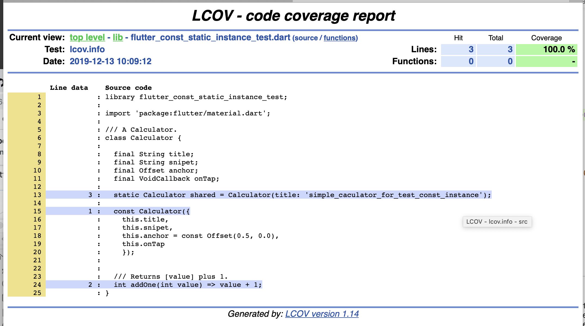
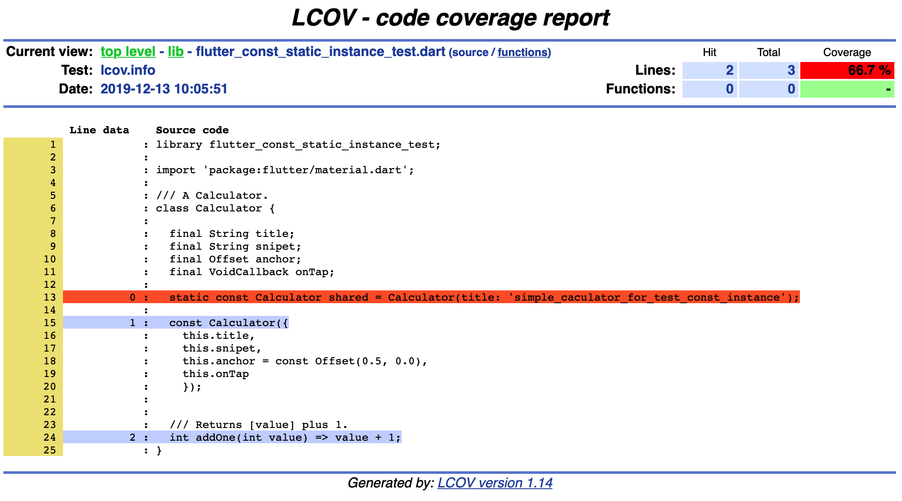

# flutter_const_static_instance_test

A simple package project test static const instance failured.

## Getting Started

## Test with static const instance failured:

## Test with static instance success:

## Detail info
1. [doctor.text](./doctor.text)
2. [coverage.text](./coverage.text)
3. [flutter_test_verbose.text](./flutter_test_verbose.text)
4. [coverage/html/index.html](./coverage/html/index.html)